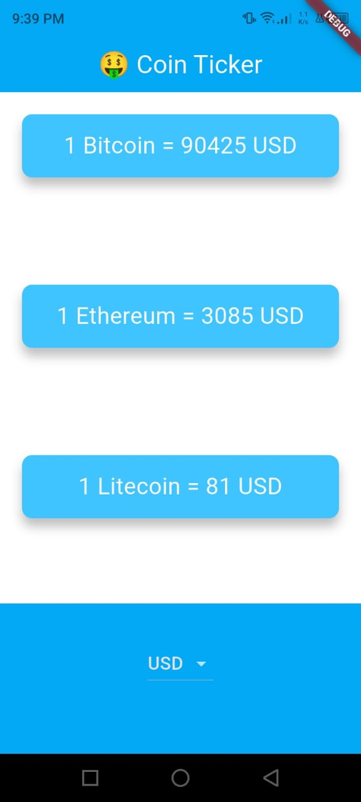
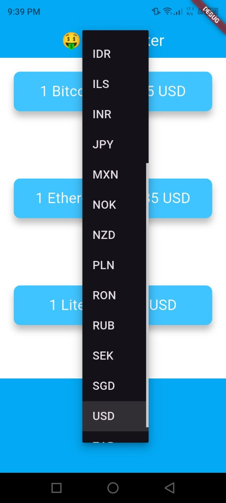
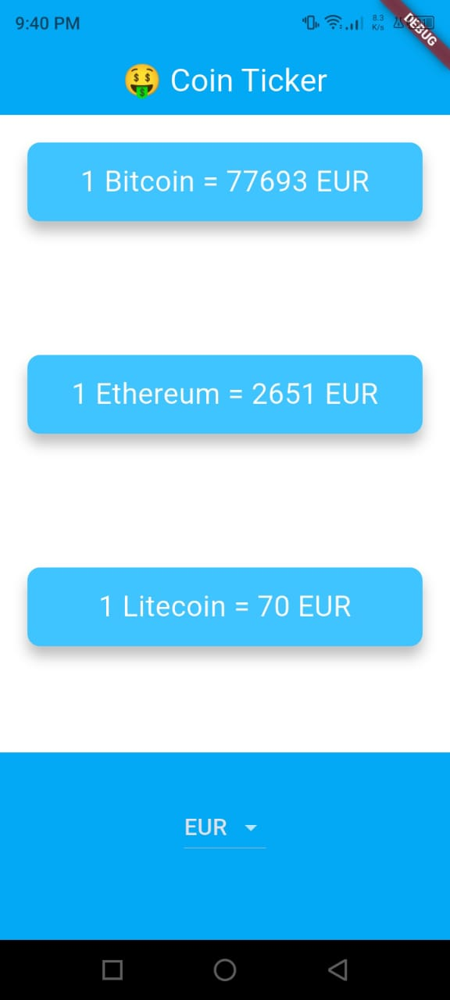

# 🤑 Coin Ticker App (Flutter)


A simple and elegant **Flutter application** that displays real-time cryptocurrency prices (Bitcoin, Ethereum, and Litecoin) in multiple fiat currencies using the **CoinGecko API**.

This project demonstrates API integration, asynchronous programming, platform-specific UI (Android & iOS), and clean Flutter architecture.

---

## 📱 Features

- 🔄 Real-time cryptocurrency prices
- 💰 Supports BTC, ETH, and LTC
- 🌍 Multiple fiat currencies (USD, EUR, GBP, etc.)
- 🤖 Uses CoinGecko public API
- 📲 Platform-specific pickers:
  - DropdownButton for Android
  - CupertinoPicker for iOS
- 🎨 Clean and reusable UI components

---

## 🛠️ Technologies Used

- **Flutter**
- **Dart**
- **HTTP package**
- **CoinGecko API**
- **Material & Cupertino widgets**

---

## 📸 Screenshots

<p align="center">
  
  
  
</p>

---

## 🔑 API Used

* **CoinGecko API**

```
https://api.coingecko.com/api/v3/simple/price
```

Example request:

```
https://api.coingecko.com/api/v3/simple/price?ids=bitcoin&vs_currencies=usd
```

---

## 🚀 Getting Started

### 1️⃣ Clone the repository

```bash
git clone https://github.com/GhBMpr/Bitcoin-Ticker-.git
```

### 2️⃣ Navigate to the project

```bash
cd Bitcoin-Ticker-
```

### 3️⃣ Install dependencies

```bash
flutter pub get
```

### 4️⃣ Run the app

```bash
flutter run
```

---

## 📂 Project Structure

```
lib/
├── coin_data.dart        # API logic & currency lists
├── price_screen.dart     # Main UI screen
├── reusable_card.dart   # Reusable UI card widget
├── main.dart             # App entry point
```

---

## 🧠 What I Learned

* Working with REST APIs in Flutter
* Handling async/await and Futures
* Platform-specific UI in Flutter
* Clean UI using reusable widgets
* State management using setState

---

## 📌 Future Improvements

* Add loading indicators
* Add error handling UI
* Support more cryptocurrencies
* Cache API responses
* Dark/Light theme toggle

---

## 👤 Author

**Ghofrane BM**
Student 📍 Tunisia

---

## ⭐ Acknowledgments

* CoinGecko for providing the free API
* Flutter documentation

---

⭐ If you like this project, don’t forget to **star the repo**!


